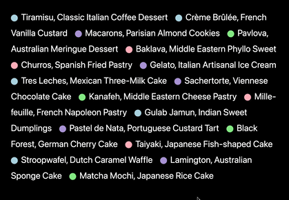

# ListSpotlight 🔦

A list component that uses hover interactions and color coding to improve content visibility and organization. Built with vanilla CSS, ListSpotlight provides visual feedback through opacity changes and color indicators, making it useful for categorized content display.

## Inspiration & Attribution

- Inspired by [Wolf Olins website](https://www.wolffolins.com/) (as of November 2024)

## Preview

## Features

### Functionality
- Dynamic spotlight effect on hover
- Smooth opacity transitions
- Inline continuous layout
- Customizable color schemes via CSS variables
- Consistent spacing and alignment

### Performance
- Zero JavaScript dependencies
- Pure CSS animations
- Minimal DOM structure

## License

This project is open source and available under the MIT License.
